# animfetch

An animated system fetch you can work inside. The art stays pinned at the top of
the screen while your prompt and command output scroll below it. Linux only.


<div align="center">
<!-- loc-start -->


<!-- loc-end -->
</div>

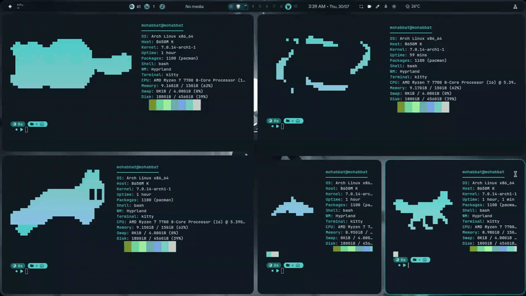


## Animations

|   |   |   |   |   |
|:---:|:---:|:---:|:---:|:---:|
|cat-run|cat-tail|fox-run|dolphin-run|blackhole|
| 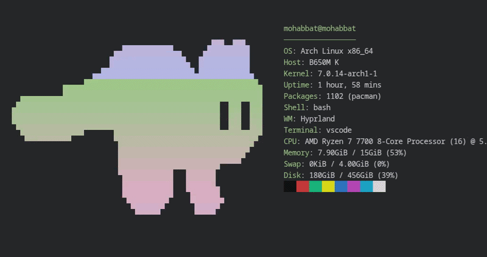 | 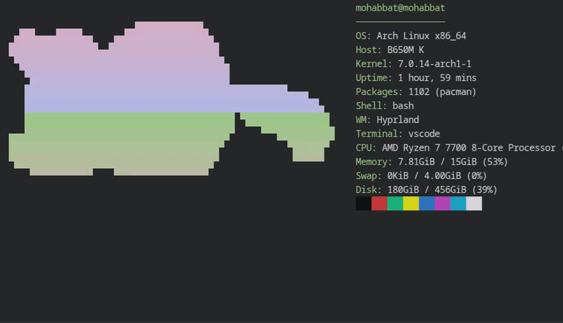 | 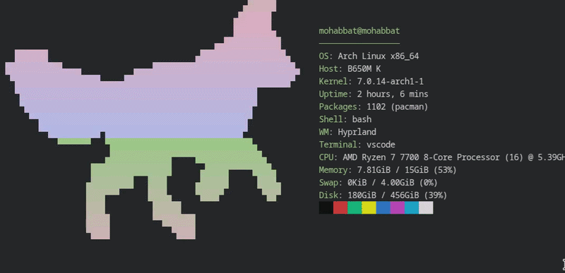 | 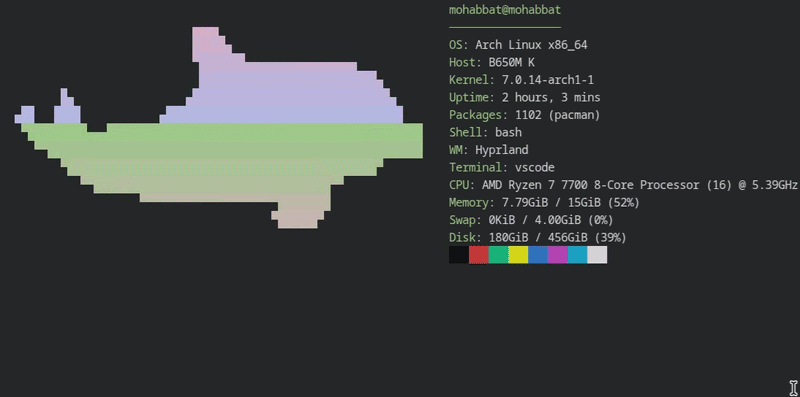 | 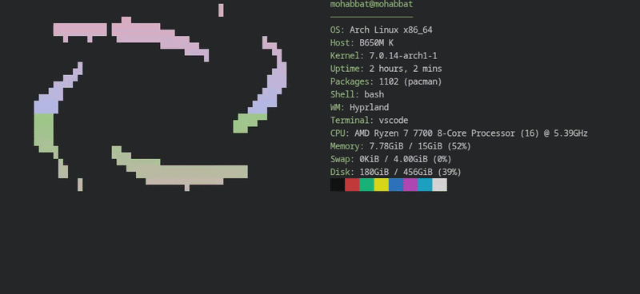 |
|butterfly|icosahedron|rabbit-run|mew|yin-yang|
| 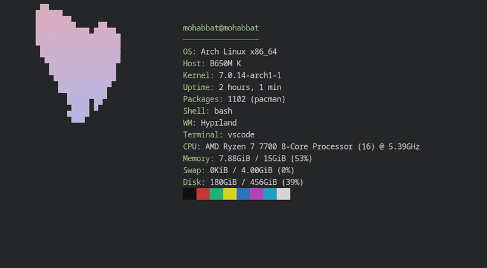 | 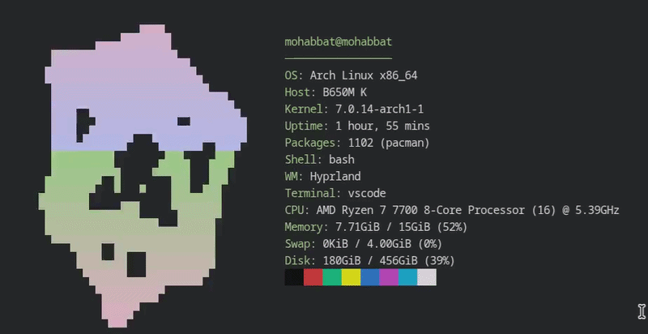 | 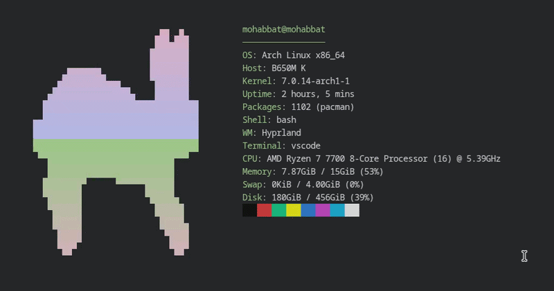 | 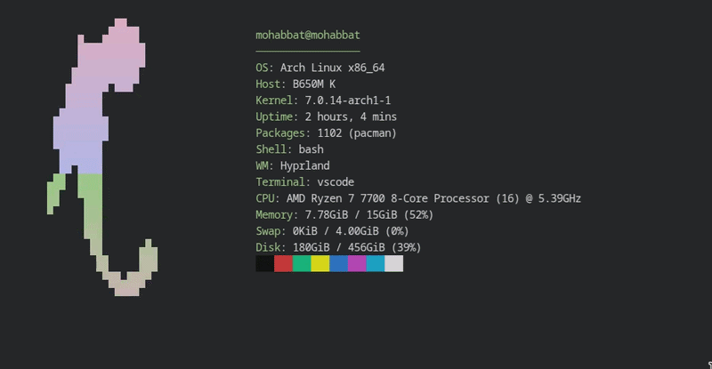 | 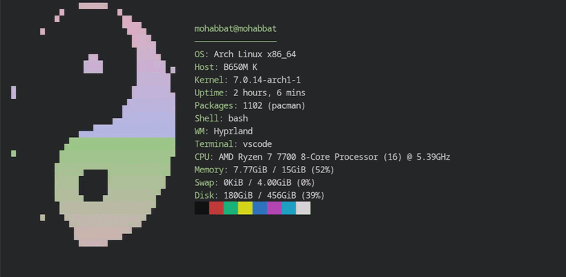 |

Pick one with `-a <name>`, or set the default with `--set <name>`.

## Install

### Arch Linux

```sh
paru -S animfetch-bin      # or animfetch-git to build from source
```

### Any Linux

```sh
curl -fsSL https://raw.githubusercontent.com/Andrew-Velox/animfetch/main/install.sh | sh
```

Static binary, no Rust needed. Goes to `~/.local/bin`, or `/usr/local/bin` as
root; `ANIMFETCH_BINDIR` overrides. Tarballs are on the [releases page][releases].

### From source

```sh
cargo install --locked --git https://github.com/Andrew-Velox/animfetch
```

Needs Rust 1.88 or newer.

[releases]: https://github.com/Andrew-Velox/animfetch/releases/latest

## Usage

```sh
animfetch --pin      # pin above your own shell, keep animating in background
animfetch --play     # animate in place for a few seconds, then exit
animfetch --once     # print one static frame and exit
animfetch            # interactive: animfetch owns the prompt
```

`--pin` is the one you want. It sets a scroll region so the top rows never
scroll, then detaches and paints them while your own shell runs underneath with
its history, completion and aliases intact. Undo with `animfetch --unpin`.

```sh
animfetch -a cat-tail        # different animation, this run only
animfetch --style quad       # half (default), quad, or ramp
animfetch --width 40         # cap the art width (0 fills the screen)
animfetch --height 12        # both caps apply, aspect ratio is kept
animfetch --fps 20
animfetch --play -s 1.5      # shorter intro
animfetch --no-color
```

Piping the output, or `NO_COLOR=1`, drops to the static path automatically.

### In your shell startup

`~/.bashrc` or `~/.zshrc`:

```sh
[[ $- == *i* ]] && command -v animfetch >/dev/null && animfetch --pin
```

`~/.config/fish/config.fish`:

```fish
status is-interactive; and type -q animfetch; and animfetch --pin
```

The guards keep it out of scripts and `scp`, which read your startup file too
and break on unexpected output. Never use bare `animfetch` here, since it waits
for input. Running `--pin` in every shell is safe: a nested one exits silently.

## Interactive mode keys

| Key | Action |
| --- | --- |
| `<text>` `Enter` | Run the command, output appears below the fetch |
| `Ctrl-C` | Interrupt a running command; at an idle prompt, quit |
| `Esc` | Quit |
| `Ctrl-D` | Quit, when the line is empty |
| `Ctrl-U` | Clear the line |
| `Ctrl-W` | Delete the last word |

`cd` and `exit` are handled internally, everything else runs under `$SHELL -c`.
No aliases, no history, no completion: a launcher with a prompt, not a shell.

## Adding your own animation

Drop plain-text frames into `~/.config/animfetch/anim/<name>/`, named so they
sort in order (`00.txt`, `01.txt`). They are picked up at runtime, and a
directory shadows a built-in of the same name. `animfetch --list` shows
everything available.

Three rules for the art:

- Any non-whitespace character counts as ink. Frames are read as a coverage
  mask, so what you draw with does not matter.
- Every frame on one canvas, padding kept as written. That is what keeps poses
  registered against each other.
- Silhouettes, not shading. Art converted from an image is all ink and comes out
  a solid blob. Detail has to be whitespace, and an enclosed gap of two cells or
  more survives scaling.

To bundle one into the binary, put it under `assets/anim/`, add it to the
`BUNDLED` table in `src/anim.rs`, then rebuild and reinstall.

## Configuration

Optional. Copy [`config.example.toml`][example] to
`~/.config/animfetch/config.toml`. Every key is optional, and a malformed file
falls back to defaults rather than refusing to start.

[example]: https://github.com/Andrew-Velox/animfetch/blob/main/config.example.toml

### Colours from your desktop theme

```sh
animfetch --once --palette      # try it without editing anything
```

```toml
color_source = "palette"        # make it permanent
```

Reads a matugen, pywal or wallust palette, whichever it finds first. Roles the
file does not define keep the colour from your config, so this can only add
colour. Under `--pin` the file is re-read when it changes, so retheming your
desktop recolours the running animation. See the `palette_*` keys in
`config.example.toml` to point it elsewhere or pick different roles.

## A note on the prompt

Interactive mode draws something that looks like a shell prompt and hands what
you type to `$SHELL`. That is a keylogger you happen to trust. The whole path is
in `src/prompt.rs`, short enough to read end to end.

## Credits

Some animations are redrawn as ASCII from [RunCat][runcat] by
[kyome22][kyome], used under the Apache License 2.0.

[runcat]: https://github.com/kyome22/menubar_runcat
[kyome]: https://github.com/kyome22


