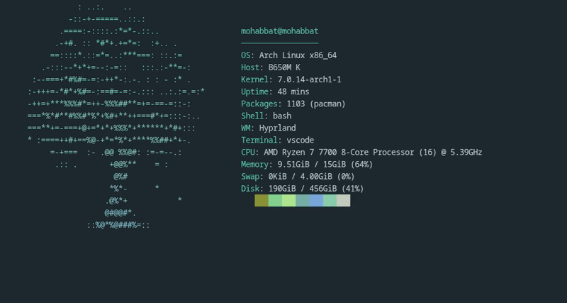
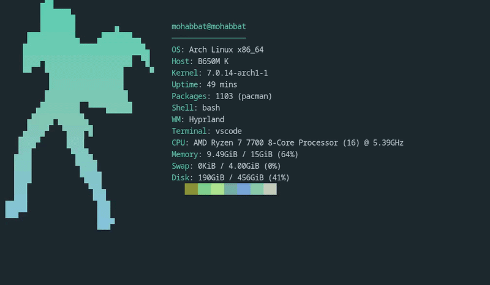
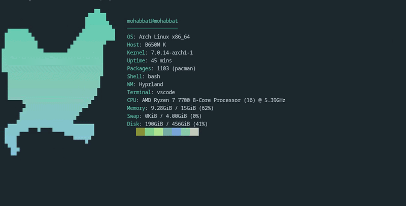
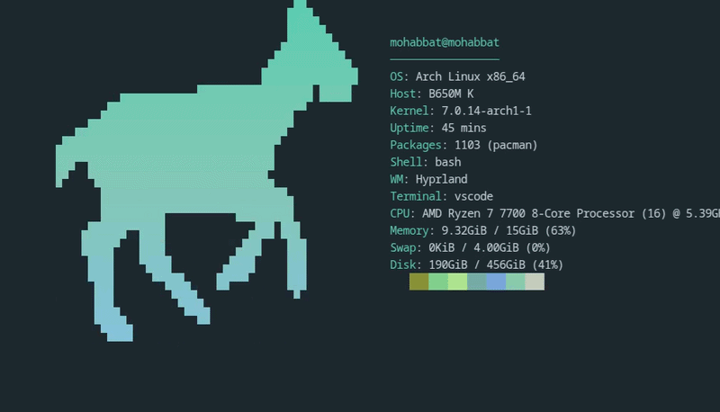
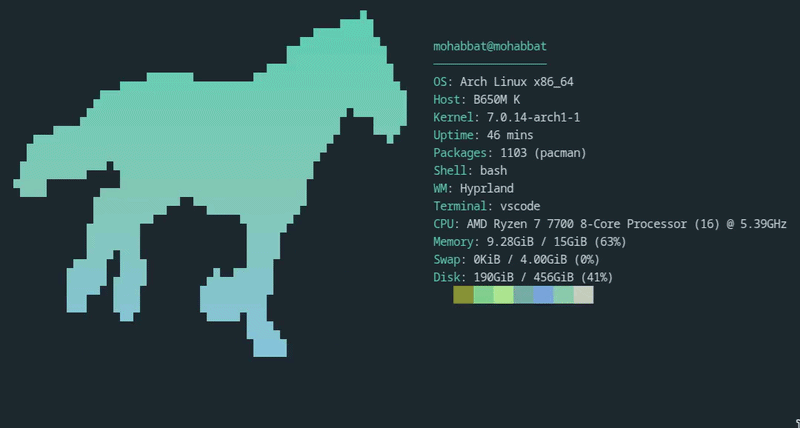
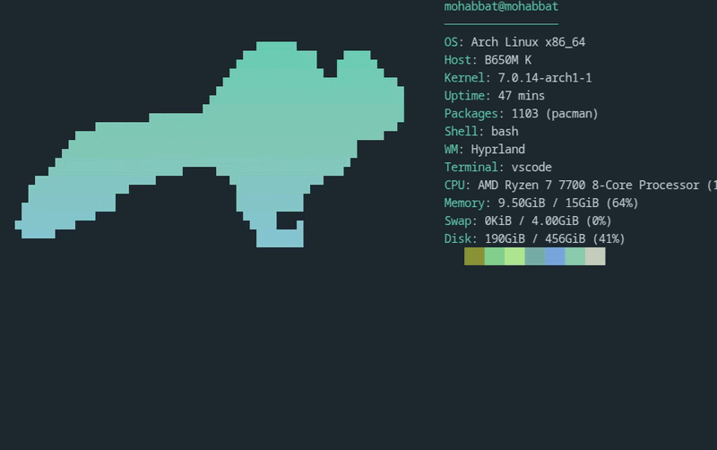
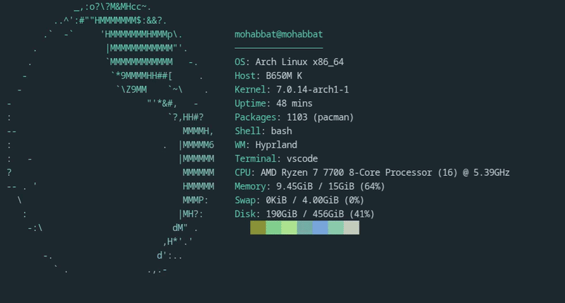
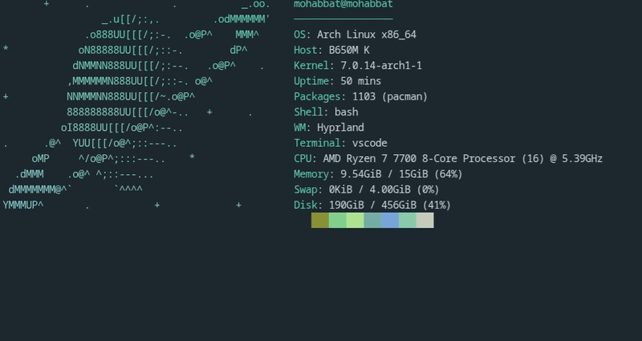

<h1 align="center">animfetch 🧊</h1>
<div align="center">

An animated system fetch you can work inside. The art stays pinned at the top of
the screen while your prompt and command output scroll below it. Linux only.


[](https://github.com/Andrew-Velox/animfetch/releases)
[](https://github.com/Andrew-Velox/animfetch)
[](LICENSE)
[](https://github.com/Andrew-Velox/animfetch)
[](https://github.com/Andrew-Velox/animfetch/issues)<!-- loc-start -->


<!-- loc-end -->

</div>


## Animations

|   |   |   |   |   |
|:---:|:---:|:---:|:---:|:---:|
|cat-run|cat-tail|fox-run|dolphin-swim|blackhole|
|  |  |  |  |  |
|butterfly|icosahedron|rabbit-run|mew|yin-yang|
|  |  |  |  |  |
|tree|boxing|chicken-run|deer-run|horse-run|
|  |  |  |  |  |
|squirrel-run|earth|saturn|||
|  |  |  | | |

Pick one with `-a <name>`, or set the default with `--set <name>`.

## Install

Arch Linux:

```sh
paru -S animfetch-bin      # or animfetch-git to build from source
```

Any Linux, static binary, no Rust needed:

```sh
curl -fsSL https://raw.githubusercontent.com/Andrew-Velox/animfetch/main/install.sh | sh
```

Goes to `~/.local/bin`, or `/usr/local/bin` as root; `ANIMFETCH_BINDIR`
overrides. Tarballs are on the [releases page][releases].

From source, with Rust 1.88 or newer:

```sh
cargo install --locked --git https://github.com/Andrew-Velox/animfetch
```

[releases]: https://github.com/Andrew-Velox/animfetch/releases/latest

## Usage

```sh
animfetch --pin      # pin above your own shell, keep animating in background
animfetch --play     # animate in place for a few seconds, then exit
animfetch --once     # print one static frame and exit
animfetch            # interactive: animfetch owns the prompt
```

`--pin` is the one you want. It sets a scroll region so the top rows never
scroll, then detaches and paints them while your own shell runs underneath with
its history, completion and aliases intact. Undo with `animfetch --unpin`.

```sh
animfetch -a cat-tail        # different animation, this run only
animfetch --style quad       # half (default), quad, ramp, or raw
animfetch --width 40         # cap the art width (0 fills the screen)
animfetch --height 12        # both caps apply, aspect ratio is kept
animfetch --fps 20
animfetch --play -s 1.5      # shorter intro
animfetch --no-color
```

Piping the output, or `NO_COLOR=1`, drops to the static path automatically.

`--style` picks how the art is drawn. `half` and `quad` render it as solid
blocks and rescale to any terminal. `ramp` maps coverage onto the characters in
`ramp`. `raw` prints the art's own characters untouched, which suits hand-drawn
ASCII like `earth`; pair it with `--width` near the art's own width, since it
samples rather than averages.

### In your shell startup

`~/.bashrc` or `~/.zshrc`:

```sh
[[ $- == *i* ]] && command -v animfetch >/dev/null && animfetch --pin
```

`~/.config/fish/config.fish`:

```fish
status is-interactive; and type -q animfetch; and animfetch --pin
```

The guards keep it out of scripts and `scp`, which break on unexpected output.
Never use bare `animfetch` here, since it waits for input.

## Interactive mode keys

| Key | Action |
| --- | --- |
| `<text>` `Enter` | Run the command, output appears below the fetch |
| `Ctrl-C` | Interrupt a running command; at an idle prompt, quit |
| `Esc` | Quit |
| `Ctrl-D` | Quit, when the line is empty |
| `Ctrl-U` | Clear the line |
| `Ctrl-W` | Delete the last word |

`cd` and `exit` are handled internally, everything else runs under `$SHELL -c`.
No aliases, no history, no completion: a launcher with a prompt, not a shell.


## Configuration

Optional. Copy [`config.example.toml`][example] to
`~/.config/animfetch/config.toml`. Every key is optional, and a malformed file
falls back to defaults.

[example]: https://github.com/Andrew-Velox/animfetch/blob/main/config.example.toml

Set `color_source = "palette"` and the fetch follows your desktop theme, reading
a matugen, pywal or wallust palette. Under `--pin` it re-reads on change, so
retheming recolours the running animation. Try it with `animfetch --once
--palette`.


## Stargazers ⭐


## Credits

Some animations are redrawn as ASCII from [RunCat][runcat] by
[kyome22][kyome], used under the Apache License 2.0.

[runcat]: https://github.com/kyome22/menubar_runcat
[kyome]: https://github.com/kyome22


<hr>

